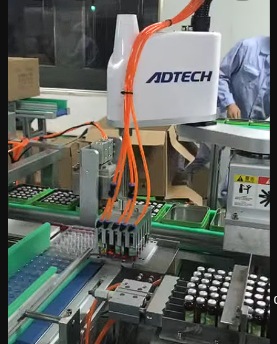

# 📚 Example of Robots by Morphology

> There are six different types of industrial robots: cartesian, SCARA, cylindrical, delta, polar and vertically articulated. Which are classified depending on the workspace the provide.

---

- **Activity name:** _Robots Morphologies_  
- **Team / Author(s):** Leonardo Zamora Hernández  
- **Course / Subject:** Applied Robotics  
- **Date:** _22/01/2026_  
- **Brief Description:** _Real life examples of robots with different morphologies_

---

## 1) Cartesian Robots (PPP)

- _They have three linear joints that use the Cartesian coordinate system (X, Y, and Z)._

  - _Cartesian 3D printers move along three axes to print. _

--- 
## 2) SCARA Robots (RRP)

- **Selective Compliance Assembly Robot Arm:** _fast, precise industrial robots ideal for high-speed pick-and-place, sorting, and assembly tasks, especially in electronics, known for their rigidity in the Z-axis (vertical) and flexibility in the XY-plane (horizontal) for smooth, accurate insertions._

  - _ADTECH SCARA for medicine line gripping and assembly._

## 3) Articulated Robots (RRR)

- _These robotS features rotary joints and can range from simple two joint structures or more. The arm is connected to the base with a twisting joint. The links in the arm are connected by rotary joints. Each joint is called an axis and provides an additional degree of freedom, or range of motion. Industrial robots commonly have four or six axes._

  - _Robotic arms are one of the most used robots in manufacturing, they simulate the structure of a human arm._

---

## 4) Spherical Robots (RRP)

- _In this configuration the arm is connected to the base with a twisting joint and a combination of two rotary joints and one linear joint. The axes form a polar coordinate system and create a spherical-shaped work envelope._

- _Unimate was the first programmable robot made by General Motors and used in their assembly line_

---

## 5) Cylindrical Robots (RPP)

-_They have at least one rotary joint at the base and at least one prismatic joint to connect the links. The rotary joint uses a rotational motion along the joint axis, while the prismatic joint moves in a linear motion. Cylindrical robots operate within a cylindrical-shaped work envelope._

- _They can work in tight spaces and are cheaper than cartesian robots._

---

## 6) Delta Robots (Parallel)

- _Built from jointed parallelograms connected to a common base. The parallelograms move a single End-of-Arm Tooling in a dome-shaped work area. Heavily used in the food, pharmaceutical, and electronic industries, this robot configuration is capable of delicate, precise movement._

- _Delta arm at the food industry._

---
