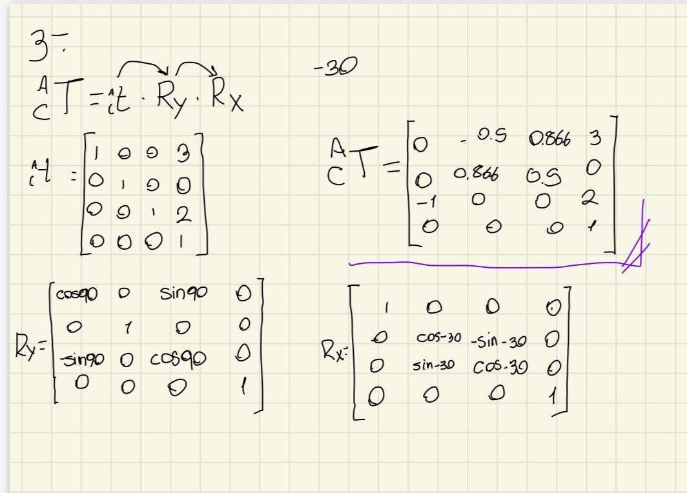

# 📚 Transform Nomenclature 

> There are six different types of industrial robots: cartesian, SCARA, cylindrical, delta, polar and vertically articulated. Which are classified depending on the workspace the provide.

---

- **Activity name:** _Transform Nomenclature_  
- **Team / Author(s):** Leonardo Zamora Hernández  
- **Course / Subject:** Applied Robotics  
- **Date:** _29/01/2026_  
- **Brief Description:** _Real life examples of robots with different morphologies_

---

---

## 1) 

--- 
## 2) 

## 3) 

---
