[Home](../index.md)

# URDF robots

## Objective:
Learn how to program robots on **rviz** using the DH tables from the **Forward Kinematcs** homework.

## What is RVIZ?

Is a tool that allows you to visualize information from a robot and its sensors in a 3D environment in real time. With this program, you can view robot models, environmental maps, navigation paths, and data from sensors.

## Steps to program a simulation

### 1.- Make a new package

We will need to create a new package to facilitate access to our files, we will only need to change the file name in the terminal (more on this later).

### 2.- Create a file

The type of file we will be using will be **xml**, the structrure is simialr as **HTML**, they are used in RViz to save the display configuration, such as the sensors, maps, robot models, and topics being shown in ROS2. This allows the same working configuration to be loaded quickly without having to configure it manually each time.

### 3.- Start programming

This line will always be the fisrt in the program.

```xml
<?xml version="1.0"?>
```
#### 3.1.- Define our robot

We need to define our section that is called **robot** or the name you would like to give it.

```xml
<robot name="my_robot">

</robot>
```

#### 3.2.- Define colors

We can use colors to visualize in a better ways the links of the robot, we can either define it inside the link name or as a global color.

The first option applies the color only i the link used, having to repeat the line of the color each link. If we use the second option we will have to write our color as another section inside **robot** so later when we are typing the visualize part we can put the color name.

Here is how the second option looks:

```xml
<material name="blue">
        <color rgba="0 0 1 1"/>
    </material>

<link name="link1">
        <visual>
            <geometry>
                <cylinder length="0.1" radius="0.05"/>
            </geometry>
            <origin xyz="0 0 0" rpy="0 0 0"/>
            <material name="blue"/>
        </visual>
```

#### 3.3.- Define the links

The format is the same as previous like a section in **HTML**. the links }helps us in 2 things to set the links so **rviz** can use themand  to stablish the visualize aspect of the links

```xml
<link name="your_link">

</link>
```

#### 3.4.- Setting the visualize

For the visual part we will follow this path:

1.- Set the shape of the link

We can use a cubic or rectangular form or even make a cylinder

**Cube**

```xml
<geometry>
    <box size="0.2 0.2 0.2"/>
</geometry>
```

**Cylinder**

```xml
<geometry>
    <cylinder length="0.5" radius="0.05"/>
</geometry>
```

2.- Set the origin and color

If we don't set the origins our figure will apper in the center  our defined plane . For the figures we will normallly move the half if the previous figure and then we can input the color.

```xml                            
  <origin xyz="0 0 .25" rpy="0
  
  <material name="gray"/>

```

3.- Add more visualize to one robot

We can input another section of a link, helping us to create a single piece more accurate to the ones od the homewor.


#### 3.4.- Setting the joints

1.- Input name and type of joint

```xml
<joint name="joint1" type="revolute">

</joint>

```

2.- Parent and child

This will tell the programs which link is the original and who is the child, this will help to stablish the movements of the links

```xml
<parent link="base_link"/>
<child link="link1"/>
```

3.- Set the origins for the reference axis

We will have to move up or down depending our figure.

```xml
<!-- es la posicion del  box o figura anterior /2 -->
<origin xyz="0 0 0.1" rpy="0 0 0"/>
```

4.- Setting up the axis and how my joint will move

My axis have a 1 value in Z because this is the length taht will be used the file to move.

```xml
<axis xyz="0 0 1"/> 
```

Finnaly we will configure the movement of the tool. The movements noeeds to be in in radians that why we use **1.57** because is similar like to use pi/2
```xml
<limit lower="-1.57" upper="1.57" effort="10" velocity="1"/>
```

#### 3.5.- Launche the program and the code

For the last part we will open our ubuntu terminal and after acces to our workspace we will write:

```bash
ros2 launch urdf_tutorial display.launch.py model:=$HOME/your_workspace/src/your_package/name_of_file.urdf
```

with this the code that we will creat and RVIZ will be running at the same time

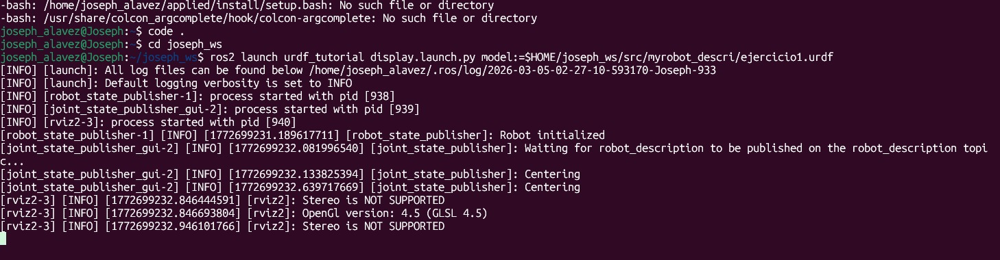

## Exercise 1

**DH table**

| L | a         | α         | θ              | d                  |
|---:|:----------|:----------|:---------------|:-------------------|
| 1 | $l_{1.2}$  | $-\pi/2$  | $-\pi/2 + q_1$ | $0$                |
| 2 | $0$        | $0$       | $0$            | $l_{1.1}+l_2+q_2$   

---

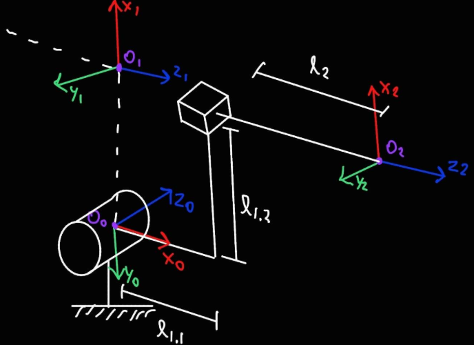

### Code

```xml
<?xml version="1.0"?>

<robot name="my_robot">
    <material name="blue">
        <color rgba="0 0 1 1"/>
    </material>

    <material name="gray">
        <color rgba="0.5 0.5 0.5 1"/>
    </material>

    <material name="red">
        <color rgba="1 0 0 1"/>
    </material>

    <material name="black">
        <color rgba="0 0 0 1"/>
    </material>

    <link name="base_link">
        <visual>
            <geometry>
                <cylinder length="0.5" radius="0.05"/>
            </geometry>
            <origin xyz="0 0 .25" rpy="0 0 0"/>
            <material name="gray"/>
        </visual>
    </link>

    <link name="link1">
        <visual>
            <geometry>
                <cylinder length="0.1" radius="0.05"/>
            </geometry>
            <origin xyz="0 0 0" rpy="0 0 0"/>
            <material name="blue"/>
        </visual>

        <!-- Poner figuras dentro de las figuras -->

        <visual>
            <geometry>
                    <box size="0.5 0.05 0.1"/>
            </geometry>
            <origin xyz="0.25 0 0" rpy="0 0 0"/>
        </visual>

        <visual>
            <geometry>
                    <box size="0.05 0.25 0.1"/>
            </geometry>
            <origin xyz="0.5 -0.1 0" rpy="0 0 0"/>
        </visual>
    </link>

    <joint name="joint1" type="revolute">
        <origin xyz="0 0 0.55" rpy="-1.57 0 0 "/>
        <parent link="base_link"/>
        <child link="link1"/>
        <axis xyz="0 0 1"/>
        <limit lower="-1.57" upper="1.57" effort="100" velocity="100"/>
    </joint>

    <link name="link2">
        <visual>
            <geometry>
                <cylinder length="0.8" radius="0.05"/>
            </geometry>
            <origin xyz="0 0 0.5" rpy="0 0 0"/>
            <material name="red"/>
        </visual>
    </link>

    <joint name="joint2" type="prismatic">
        <origin xyz="0 -0.25 0" rpy="-1.57 0 -1.57"/>
        <parent link="link1"/>
        <child link="link2"/>
        <axis xyz="0 0 1"/>
        <limit lower="-.25" upper=".35" effort="100" velocity="100"/>
    </joint>

    <link name="link3">
    </link>

    <joint name="joint3" type="fixed">
        <origin xyz="0 0 0.9" rpy="0 0 0"/>
        <parent link="link2"/>
        <child link="link3"/>
        <axis xyz="0 0 0"/>
    </joint>
</robot>
```

### Result
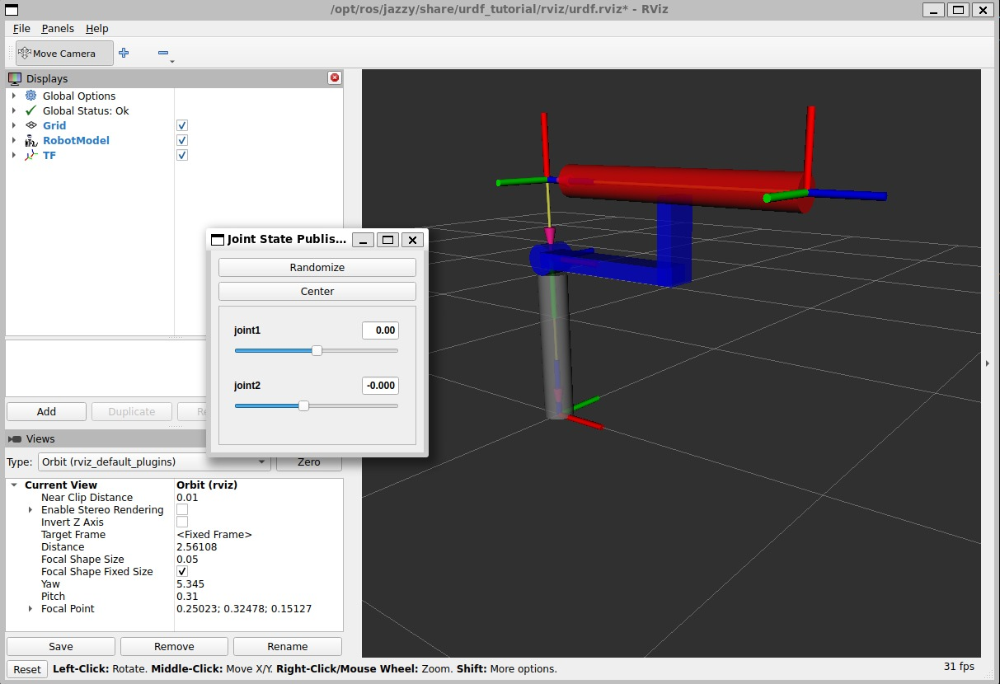

## Exercise 2

**DH table**

| L | a   | α       | θ       | d            |
|---:|:----|:--------|:--------|:-------------|
| 1 | $0$ | $\pi/2$ | $\pi/2$ | $l_1 + q_1$  |
| 2 | $0$ | $\pi/2$ | $\pi/2$ | $l_2 + q_2$  |
| 3 | $0$ | $\pi$   | $0$     | $l_3 + q_3$  |

---

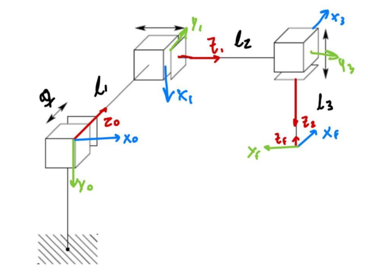

### Code

```xml
<?xml version="1.0"?>
<robot name="my_robot">

  <material name="table">
    <color rgba="0.5098 0.3882 0.1294 1"/>
  </material>

  <material name="link_A">
    <color rgba="0.160 0.360 0.420 1"/>
  </material>

  <link name="base_link">
    <visual>
      <origin xyz="0 0 0" rpy="0 0 0"/>
      <geometry>
        <box size="10 10 0.2"/>
      </geometry>
      <material name="table"/>
    </visual>
  </link>

  <link name="b0">
    <visual>
      <origin xyz="0 0 -0.5" rpy="0 0 0"/>
      <geometry>
        <box size="1 1 0.85"/>
      </geometry>
      <material name="link_A"/>
    </visual>
  </link>

  <link name="link0">
    <visual>
      <origin xyz="0 0 0.15" rpy="0 0 0"/>
      <geometry>
        <box size="1 1 0.15"/>
      </geometry>
      <material name="link_A"/>
    </visual>
  </link>

  <joint name="jb0" type="fixed">
    <parent link="base_link"/>
    <child link="b0"/>
    <origin xyz="0 0 5" rpy="-1.57 0 0"/>
  </joint>

  <joint name="joint0" type="prismatic">
    <parent link="base_link"/>
    <child link="link0"/>
    <origin xyz="0 0 5" rpy="-1.57 0 0"/>
    <axis xyz="0 0 1"/>
    <limit lower="0" upper="2" effort="100" velocity="100"/>
  </joint>

  <link name="link1">
    <visual>
      <origin xyz="0 0 0.15" rpy="0 0 0"/>
      <geometry>
        <box size="1 1 0.15"/>
      </geometry>
      <material name="link_A"/>
    </visual>
  </link>

  <link name="b1">
    <visual>
      <origin xyz="0 0 -0.5" rpy="0 0 0"/>
      <geometry>
        <box size="1 1 0.85"/>
      </geometry>
      <material name="link_A"/>
    </visual>
  </link>

  <joint name="jb1" type="fixed">
    <parent link="link0"/>
    <child link="b1"/>
    <origin xyz="0 0 3" rpy="1.57 0 1.57"/>
  </joint>

  <joint name="joint1" type="prismatic">
    <parent link="link0"/>
    <child link="link1"/>
    <origin xyz="0 0 3" rpy="1.57 0 1.57"/>
    <axis xyz="0 0 1"/>
    <limit lower="0" upper="2" effort="100" velocity="100"/>
  </joint>

  <link name="link2">
    <visual>
      <origin xyz="0 0 0.15" rpy="0 0 0"/>
      <geometry>
        <box size="1 1 0.15"/>
      </geometry>
      <material name="link_A"/>
    </visual>
  </link>

  <link name="b2">
    <visual>
      <origin xyz="0 0 -0.5" rpy="0 0 0"/>
      <geometry>
        <box size="1 1 0.85"/>
      </geometry>
      <material name="link_A"/>
    </visual>
  </link>

  <joint name="jb2" type="fixed">
    <parent link="link1"/>
    <child link="b2"/>
    <origin xyz="0 0 3" rpy="1.57 0 1.57"/>
  </joint>

  <joint name="joint2" type="prismatic">
    <parent link="link1"/>
    <child link="link2"/>
    <origin xyz="0 0 3" rpy="1.57 0 1.57"/>
    <axis xyz="0 0 1"/>
    <limit lower="0" upper="2" effort="100" velocity="100"/>
  </joint>

  <link name="link3">
    <visual>
      <origin xyz="0 0 0" rpy="0 0 0"/>
      <geometry>
        <sphere radius="0.25"/>
      </geometry>
      <material name="link_A"/>
    </visual>
  </link>

  <joint name="joint3" type="fixed">
    <parent link="link2"/>
    <child link="link3"/>
    <origin xyz="0 0 1" rpy="3.14 0 0"/>
  </joint>

</robot>
```

### Result
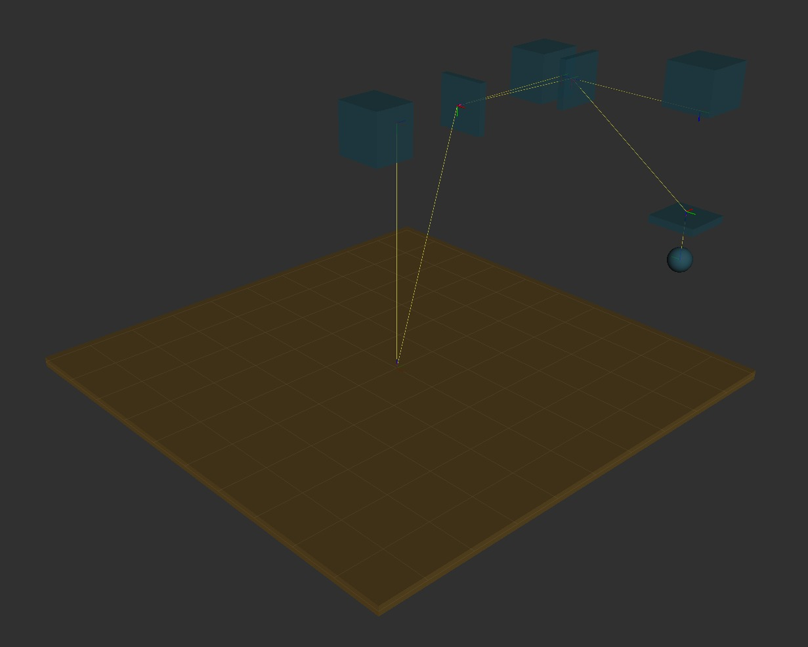

## Exercise 3

**DH table**

| L | a     | α        | θ            | d            |
|---:|:------|:---------|:-------------|:-------------|
| 1 | $0$   | $-\pi/2$ | $q_1$        | $l_1$        |
| 2 | $l_2$ | $0$      | $q_2$        | $0$          |
| 3 | $0$   | $\pi/2$  | $\pi/2+q_3$  | $0$          |
| 4 | $0$   | $-\pi/2$ | $\pi/2+q_4$  | $l_3+l_4$    |
| 5 | $0$   | $\pi/2$  | $q_5$        | $0$          |
| 6 | $0$   | $0$      | $q_6$        | $l_5+l_6$    |

---

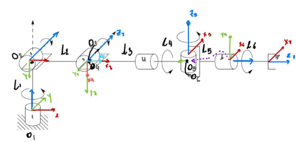

### Code

```xml
<?xml version="1.0"?>
<robot name="my_robot">

    <material name="blue"> <color rgba="0 0 1 1"/> </material>
    <material name="gray"> <color rgba="0.5 0.5 0.5 1"/> </material>
    <material name="red"> <color rgba="1 0 0 1"/> </material>
    <material name="black"> <color rgba="0 0 0 1"/> </material>
    <material name="white_spidey"> <color rgba="1 1 1 0.2"/> </material>

    <link name="base_link">
        <visual>
            <geometry> <box size="0.2 0.2 0.2"/> </geometry>
            <origin xyz="0 0 0" rpy="0 0 0"/>
            <material name="blue"/>
        </visual>
    </link>

    <link name="link_base">
        <visual>
            <geometry> <cylinder radius="0.05" length="1.0"/> </geometry>
            <origin xyz="0 0 0.5" rpy="0 0 0"/>
            <material name="gray"/>
        </visual>
    </link>

    <joint name="jointfixed" type="fixed">
        <origin xyz="0 0 0.1" rpy="0 0 0"/>
        <parent link="base_link"/>
        <child link="link_base"/>
    </joint>

    <link name="link1">
    </link>

    <joint name="joint1" type="revolute">
        <origin xyz="0 0 0" rpy="0 0 0"/>
        <parent link="link_base"/>
        <child link="link1"/>
        <axis xyz="0 0 1"/>
        <limit lower="-1.57" upper="1.57" effort="10" velocity="1"/>
    </joint>

    <link name="link2">
        <visual>
            <geometry> <cylinder radius="0.04" length="1.0"/> </geometry>
            <origin xyz="0.5 0 0" rpy="0 1.57 0"/>
            <material name="white_spidey"/>
        </visual>
    </link>

    <joint name="joint2" type="revolute">
        <origin xyz="0 0 1" rpy="-1.57 0 0"/>
        <parent link="link1"/>
        <child link="link2"/>
        <axis xyz="0 0 1"/>
        <limit lower="-1.57" upper="1.57" effort="10" velocity="1"/>
    </joint>

    <link name="link3">
    </link>

    <joint name="joint3" type="revolute">
        <origin xyz="1 0 0" rpy="0 0 0"/>
        <parent link="link2"/>
        <child link="link3"/>
        <axis xyz="0 0 1"/>
        <limit lower="-1.57" upper="1.57" effort="10" velocity="1"/>
    </joint>

    <link name="link4">
        <visual>
            <geometry> <cylinder radius="0.04" length="2.0"/> </geometry>
            <origin xyz="0 0 1.0" rpy="0 0 0"/>
            <material name="white_spidey"/>
        </visual>
    </link>

    <joint name="joint4" type="revolute">
        <origin xyz="0 0 0" rpy="1.57 0 1.57"/>
        <parent link="link3"/>
        <child link="link4"/>
        <axis xyz="0 0 1"/>
        <limit lower="-1.57" upper="1.57" effort="10" velocity="1"/>
    </joint>

    <link name="link5">
    </link>

    <joint name="joint5" type="revolute">
        <origin xyz="0 0 2" rpy="-1.57 0 1.57"/>
        <parent link="link4"/>
        <child link="link5"/>
        <axis xyz="0 0 1"/>
        <limit lower="-1.57" upper="1.57" effort="10" velocity="1"/>
    </joint>

    <link name="link6">
        <visual>
            <geometry> <cylinder radius="0.03" length="2.0"/> </geometry>
            <origin xyz="0 0 1.0" rpy="0 0 0"/>
            <material name="white_spidey"/>
        </visual>
    </link>

    <joint name="joint6" type="revolute">
        <origin xyz="0 0 0" rpy="1.57 0 0"/>
        <parent link="link5"/>
        <child link="link6"/>
        <axis xyz="0 0 1"/>
        <limit lower="-1.57" upper="1.57" effort="10" velocity="1"/>
    </joint>

    <link name="link7">
        <visual>
            <geometry> <sphere radius="0.05"/> </geometry>
            <material name="red"/>
        </visual>
    </link>

    <joint name="joint7" type="fixed">
        <origin xyz="0 0 2" rpy="0 0 0"/>
        <parent link="link6"/>
        <child link="link7"/>
    </joint>

</robot>
```

### Result
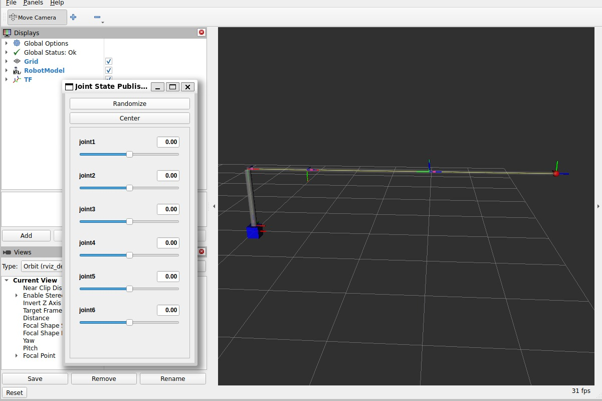

## Exercise 4

**DH table**

| L | $d_z$  | a   | α        | Θ              |
|---:|:-------|:----|:---------|:---------------|
| 1 | $l_1$  | $0$ | $-\pi/2$ | $q_1$          |
| 2 | $0$    | $l_2$ | $0$    | $q_2$          |
| 3 | $-l_3$ | $0$ | $\pi/2$  | $\pi/2+q_3$    |
| 4 | $l_4$  | $0$ | $-\pi/2$ | $q_4$          |
| 5 | $0$    | $0$ | $\pi/2$  | $-\pi/2+q_5$   |
| 6 | $l_6$  | $0$ | $0$      | $q_6$          |

---

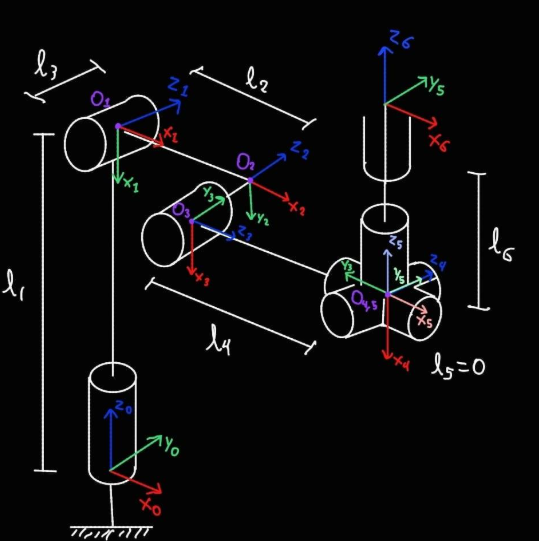

### Code

```xml
<?xml version="1.0"?>

<robot name="my_robot">
        <material name="gray">
            <color rgba="0.75 0.75 0.5 1"/>
        </material>
        <material name="black">
            <color rgba="0 0 0 1"/>
        </material>

    <link name="base_link">
        <origin xyz="0 0 0" rpy="0 0 0"/>
        <visual>
            <geometry>
                <box size="10 10 0.2" />
            </geometry>
            <material name="blue">
                <color rgba="0 0 1 1"/>
            </material>
        </visual>
    </link>


    <link name="link1">
        <visual>
            <geometry>
                <cylinder radius="0.1" length="5" />
            </geometry>
            <origin xyz="0 0 2.6" rpy="0 0 0"/>
            <material name="gray">
            </material>
        </visual>
    </link>

    <joint name="joint1" type="revolute">
        <origin xyz="0 0 0" rpy="0 0 0"/>
        <parent link="base_link"/>
        <child link="link1"/>
        <axis xyz="0 0 1"/>
        <limit lower="-1.57" upper="1.57" effort="100" velocity="100"/>
    </joint>

    
    <link name="link2">
        <visual>
            <geometry>
                <cylinder radius="0.1" length="3" />
            </geometry>
            <origin xyz="1.5 0 0" rpy="0 -1.57 0"/>
            <material name="gray">
            </material>
        </visual>
    </link>

    <joint name="joint2" type="revolute">
        <origin xyz="0 0 5" rpy="-1.57 0 0"/>
        <parent link="link1"/>
        <child link="link2"/>
        <axis xyz="0 0 1"/>
        <limit lower="-1.57" upper="1.57" effort="100" velocity="100"/>
    </joint>


    <link name="link3">
        <visual>
            <geometry>
                <cylinder radius="0.1" length="2" />
            </geometry>
            <origin xyz="0 0 -1" rpy="0 0 0"/>
            <material name="gray">
            </material>
        </visual>
    </link>

    <joint name="joint3" type="revolute">
        <origin xyz="3 0 0" rpy="0 0 0"/>
        <parent link="link2"/>
        <child link="link3"/>
        <axis xyz="0 0 1"/>
        <limit lower="-1.57" upper="1.57" effort="100" velocity="100"/>
    </joint>


    <link name="link4">
        <visual>
            <geometry>
                <cylinder radius="0.1" length="3" />
            </geometry>
            <origin xyz="0 0 1.5" rpy="0 0 0"/>
            <material name="gray">
            </material>
        </visual>
    </link>

    <joint name="joint4" type="revolute">
        <origin xyz="0 0 -2" rpy="1.57 0 1.57"/>
        <parent link="link3"/>
        <child link="link4"/>
        <axis xyz="0 0 1"/>
        <limit lower="-1.57" upper="1.57" effort="100" velocity="100"/>
    </joint>


    <link name="link5">
          <visual>
            <geometry>
                <cylinder radius="0.1" length="1" />
            </geometry>
            <origin xyz="0 0 0" rpy="0 0 0"/>
            <material name="black">
            </material>
        </visual>
    </link>

    <joint name="joint5" type="revolute">
        <origin xyz="0 0 3" rpy="-1.57 0 0"/>
        <parent link="link4"/>
        <child link="link5"/>
        <axis xyz="0 0 1"/>
        <limit lower="-1.57" upper="1.57" effort="100" velocity="100"/>
    </joint>


    <link name="link6">
        <visual>
            <geometry>
                <cylinder radius="0.1" length="2" />
            </geometry>
            <origin xyz="0 0 1" rpy="0 0 0"/>
            <material name="black">
            </material>
        </visual>
    </link>

    <joint name="joint6" type="revolute">
        <origin xyz="0 0 0" rpy="1.57 0 -1.57"/>
        <parent link="link5"/>
        <child link="link6"/>
        <axis xyz="0 0 1"/>
        <limit lower="-1.57" upper="1.57" effort="100" velocity="100"/>
    </joint>


    <link name="link7">
        <visual>
            <geometry>
                <box size="0.2 0.2 0.2"/>
            </geometry>
            <origin xyz="0 0 0.1" rpy="0 0 0"/>
            <material name="grey">
            </material>
        </visual>
    </link>

    <joint name="joint7" type="fixed">
        <origin xyz="0 0 2" rpy="0 0 0"/>
        <parent link="link6"/>
        <child link="link7"/>
    </joint>


</robot>
```

### Result
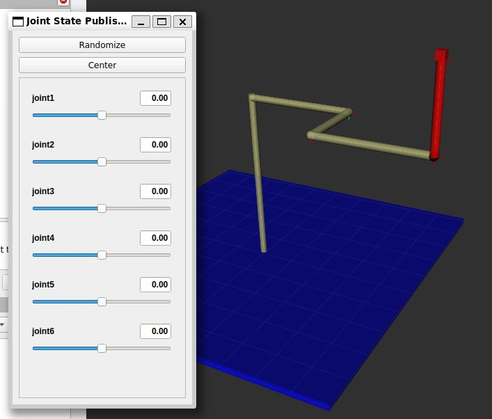

## Exercise 5

**DH table**

| L | $d_z$ | a     | α        | θ              |
|---:|:------|:------|:---------|:---------------|
| 1 | $0$   | $0$   | $\pi/2$  | $\pi/2+q_1$    |
| 2 | $0$   | $l_2$ | $-\pi/2$ | $\pi/2+q_2$    |
| 3 | $0$   | $0$   | $\pi/2$  | $q_3$          |
| 4 | $l_4$ | $0$   | $\pi/2$  | $q_4$          |
| 5 | $0$   | $0$   | $-\pi/2$ | $q_5$          |
| 6 | $l_6$ | $0$   | $0$      | $-\pi/2+q_6$   |

---


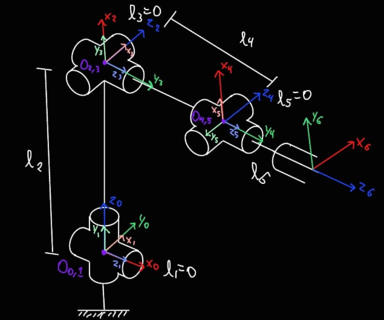

### Code

```xml
<?xml version="1.0"?>

<robot name="my_robot">
    <material name="blue">
        <color rgba="0 0 1 1"/>
    </material>

    <material name="gray">
        <color rgba="0.5 0.5 0.5 1"/>
    </material>

    <material name="red">
        <color rgba="1 0 0 1"/>
    </material>

    <material name="black">
        <color rgba="0 0 0 1"/>
    </material>

    <link name="base_link">
        <visual>
            <geometry>
                <cylinder length="0.5" radius=".8"/>
            </geometry>
            <origin xyz="0 0 0" rpy="0 0 0"/>
            <material name="gray"/>
        </visual>
    </link>

    <link name="link1">
        <visual>
            <geometry>
                <cylinder length="0.5" radius="0.5"/>
            </geometry>
            <origin xyz="0 0 0" rpy="0 0 0"/>
            <material name="blue"/>
        </visual>
    </link>

    <joint name="joint1" type="revolute">
        <origin xyz="0 0 0.5" rpy="0 0 0 "/>
        <parent link="base_link"/>
        <child link="link1"/>
        <axis xyz="0 0 1"/>
        <limit lower="-2.5" upper="2.5" effort="100" velocity="100"/>
    </joint>

    <link name="link2">
        <visual>
            <geometry>
                <cylinder length="1.5" radius="0.125"/>
            </geometry>
            <origin xyz="0 0 0" rpy="0 1.57 0"/>
            <material name="blue"/>
        </visual>

        <visual>
            <geometry>
                <box size="0.5 1.1  0.5"/>
            </geometry>
            <origin xyz="0 0.8 0" rpy="0 1.57 0"/>
            <material name="blue"/>
        </visual>
    </link>

    <joint name="joint2" type="revolute">
        <origin xyz="0 0 0" rpy="1.57 0 1.57"/>
        <parent link="link1"/>
        <child link="link2"/>
        <axis xyz="1 0 0"/>
        <limit lower="-0.785" upper="0.785" effort="100" velocity="100"/>
    </joint>

    <link name="link3">
        <visual>
            <geometry>
                <box size="0.3 0.3 1"/>
            </geometry>
            <origin xyz="0 0 0" rpy="1.57 0 0"/>
            <material name="gray"/>
        </visual>
        <visual>
            <geometry>
                <cylinder length="0.5" radius="0.1"/>
            </geometry>
            <origin xyz="0 -0.3 0" rpy="0 0 0"/>
        </visual>
    </link>

    <joint name="joint3" type="revolute">
        <origin xyz="0 1.5 0" rpy="1.57 0 1.57 "/>
        <parent link="link2"/>
        <child link="link3"/>
        <axis xyz="0 0 1"/>
        <limit lower="-0.785" upper="0.785" effort="100" velocity="100"/>
    </joint>

    <link name="link4">
    </link>

    <joint name="joint4" type="fixed">
        <origin xyz="0 0 0" rpy="1.57 0 0"/>
        <parent link="link3"/>
        <child link="link4"/>
        <axis xyz="0 0 0"/>
    </joint>

        <link name="link5">
        <visual>
            <geometry>
                <cylinder length="1" radius="0.125"/>
            </geometry>
            <origin xyz="0 0 1" rpy="0 0 0"/>
            <material name="gray"/>
        </visual>
    </link>

    <joint name="joint5" type="revolute">
        <origin xyz="0 0 0" rpy="3.14 0 1.57"/>
        <parent link="link4"/>
        <child link="link5"/>
        <axis xyz="0 0 1"/>
        <limit lower="-3.14" upper="3.14" effort="100" velocity="100"/>
    </joint>

    <link name="link6">
    </link>

    <joint name="joint6" type="fixed">
        <origin xyz="0 0 1.5" rpy="-1.57 0 -1.57"/>
        <parent link="link5"/>
        <child link="link6"/>
        <axis xyz="0 0 0"/>
        <limit lower="-3.14" upper="3.14" effort="100" velocity="100"/>
    </joint>

    <link name="link7">
        <visual>
            <geometry>
                <box size="0.3 0.3 0.3"/>
            </geometry>
            <origin xyz="0 0.15 0" rpy="0 0 0"/>
            <material name="blue"/>
        </visual>
    </link>

    <joint name="joint7" type="revolute">
        <origin xyz="0 0 0" rpy="0 0 3.14"/>
        <parent link="link6"/>
        <child link="link7"/>
        <axis xyz="0 0 1"/>
        <limit lower="-0.785" upper="0.785" effort="100" velocity="100"/>
    </joint>

    <link name="link8">
        <visual>
            <geometry>
                <cylinder length="0.1" radius="0.125"/>
            </geometry>
            <origin xyz="0 0 0.3" rpy="0 0 1.57 "/>
            <material name="red"/>
        </visual>
    </link>

    <joint name="joint8" type="revolute">
        <origin xyz="0 0 0" rpy="-1.57 0 0"/>
        <parent link="link7"/>
        <child link="link8"/>
        <axis xyz="0 0 1"/>
        <limit lower="-3.14" upper="3.14" effort="100" velocity="100"/>
    </joint>

    <link name="link9">
    </link>

    <joint name="joint9" type="fixed">
        <origin xyz="0 0 .35" rpy="0 0 0"/>
        <parent link="link8"/>
        <child link="link9"/>
        <axis xyz="0 0 0"/>
        <limit lower="-3.14" upper="3.14" effort="100" velocity="100"/>
    </joint>

</robot>
```

### Result
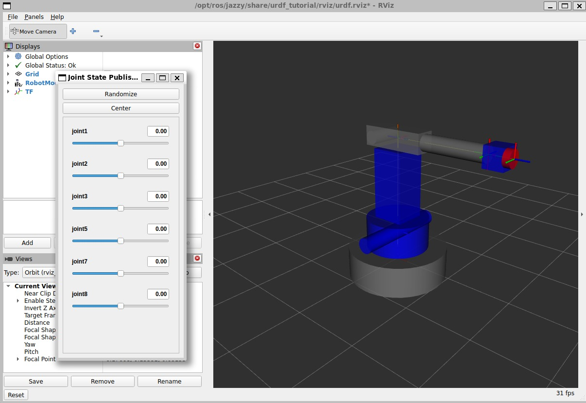