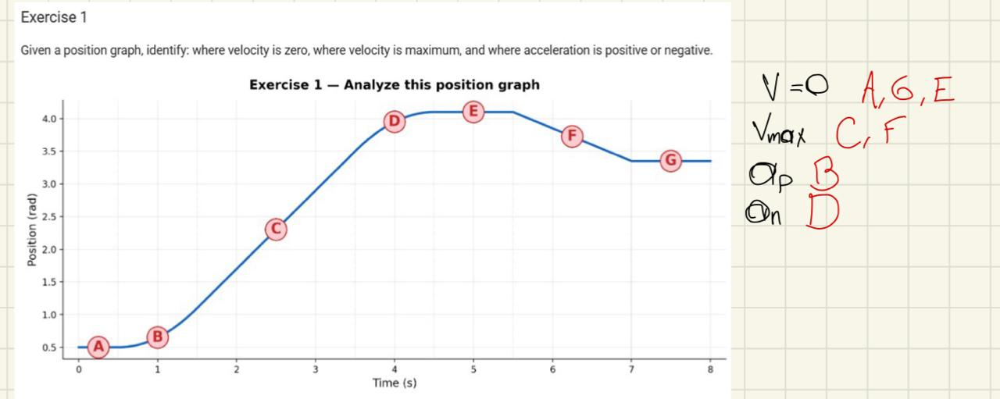
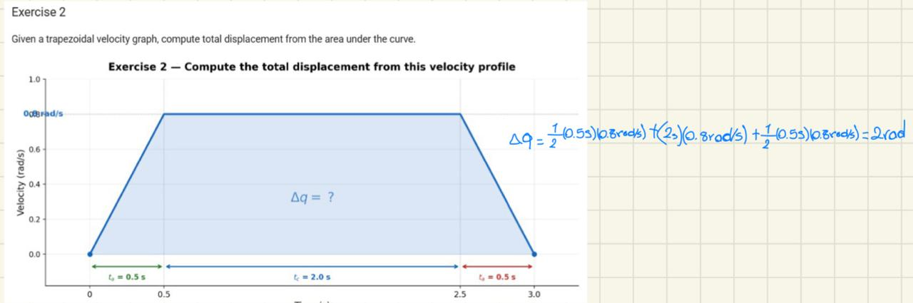
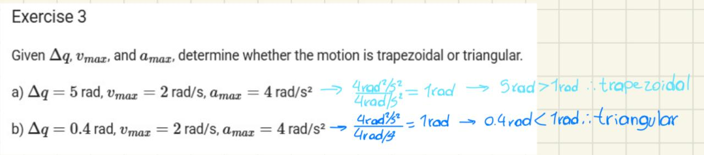
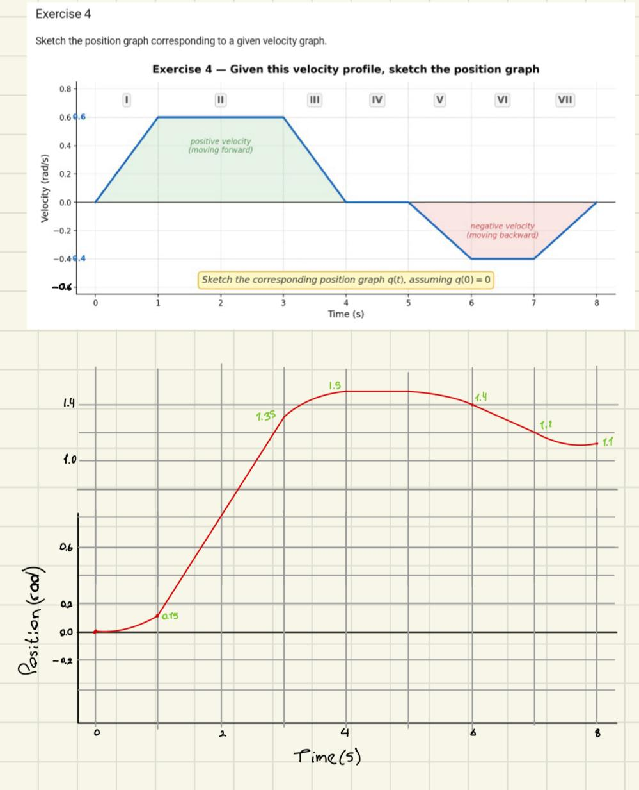
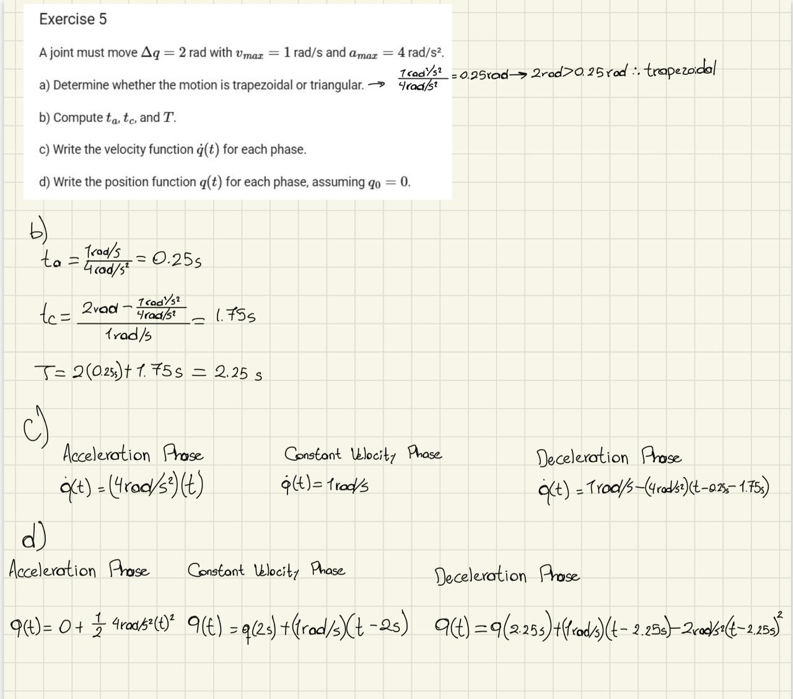
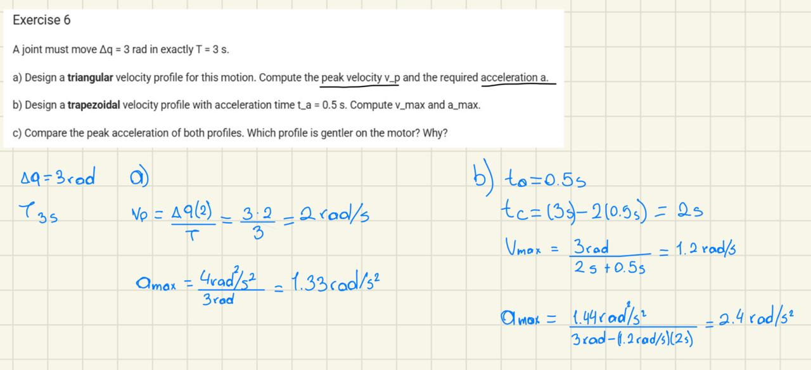

# Trajectory Planning I: Speed, Acceleration Ramps, and Profiles

This documentation covers the fundamental concepts of joint-space trajectory generation, focusing on the relationship between position, velocity, and acceleration graphs.

## 1. Analysis of Kinematic Curves

**Objective:** Identify the physical state of the actuator based on the slope of the position graph.
* **Observation:** In this exercise, we analyzed where velocity $v(t)$ is zero (flat horizontal lines), where it reaches its maximum (steepest slope), and the sign of the acceleration $a(t)$ based on the curvature of the displacement.

## 2. Displacement via Integration (Area Under the Curve)

**Objective:** Calculate total displacement $\Delta q$ using the geometric properties of the velocity profile.
* **Concept:** Since $q(t) = q(0) + \int \dot{q}(t) dt$, the total change in position corresponds to the area under the trapezoidal velocity curve. 
* **Calculation:** $\Delta q = \text{Area}_{trapezoid} = \frac{(T + t_c) \cdot v_{max}}{2}$.

## 3. Profile Classification: Trapezoidal vs. Triangular

**Objective:** Determine if a motion reaches its steady-state velocity $v_{max}$ given physical constraints.
* **Condition:** A triangular profile occurs if $\Delta q < \frac{v_{max}^2}{a_{max}}$.
* **Case Study:** * (a) $\Delta q = 5$ rad: Results in a **Trapezoidal** profile (sufficient distance to cruise).
    * (b) $\Delta q = 0.4$ rad: Results in a **Triangular** profile (acceleration exceeds half the distance before reaching $v_{max}$).

## 4. Synthesis of Position from Velocity

**Objective:** Manually derive the position profile from a given piecewise velocity function.
* **Key Transitions:** * Constant velocity $\rightarrow$ Linear position ramp.
    * Constant acceleration (ramp in velocity) $\rightarrow$ Parabolic position curve.
    * Zero velocity $\rightarrow$ Constant position (dwell).

## 5. Mathematical Modeling of a Trapezoidal Move

**Objective:** Full analytical derivation of a trajectory for $\Delta q = 2$ rad, $v_{max} = 1$ rad/s, and $a_{max} = 4$ rad/s².
* **Results:**
    * **Acceleration time ($t_a$):** 0.25 s
    * **Cruise time ($t_c$):** 1.75 s
    * **Total time ($T$):** 2.25 s
* **Equations:** Documented the piecewise functions for $q(t)$ across the three phases.

## 6. Design Comparison: Triangular vs. Trapezoidal

**Objective:** Design a trajectory to meet a strict time constraint ($T = 3$ s for $\Delta q = 3$ rad).
* **Comparison:**
    * **Triangular:** Requires higher peak velocity ($v_p = 2$ rad/s) and higher acceleration.
    * **Trapezoidal ($t_a = 0.5$s):** Provides a smoother transition with $v_{max} = 1.2$ rad/s.
* **Conclusion:** The trapezoidal profile is preferred for the XAVIMATRONIC actuators as it reduces mechanical jerk and motor stress.