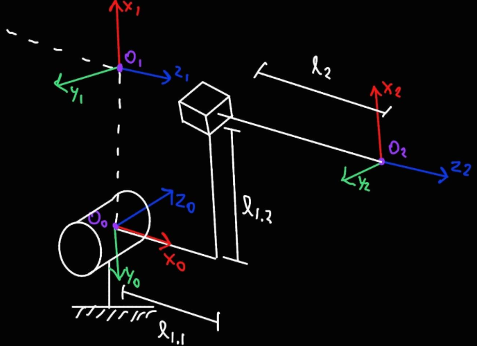
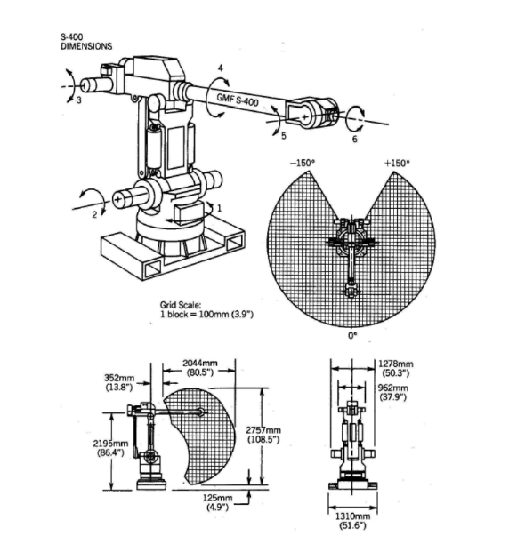

# 📚 Forward Kinematics

> Forward Kinematics by the Denavit-Hatenberg parameters

---

- **Activity name:** _Forward Kinematics_  
- **Team / Author(s):** Leonardo Zamora Hernández  
- **Course / Subject:** Applied Robotics  
- **Date:** _5/02/2026_  


---

[Home](../index.md)

# Forward Kinematics

## Objective:
Upload the matrix  and DH placement of the frames, for the robots in the pdf

## How we solve the matrix multiplication
For the following problems, we used Matlab to solve all the matrices. The script calculates the matrices both individually (between each frame) and calculates the homogeneous transformation matrix between frame 0 and the frame associated with the final element of the robot. 

The Matlab script was the following: 

``` codigo
%% Denavit–Hartenberg (able Evaluator) 

% Computes individual link transforms (A_i) and cumulative transforms T_0_i. 

 

% Notes: 

% - Angles are in radians. 

% - This script can be configured for different types of joints. 

% -------------------- Local Function: Standard DH homogeneous transform -------------------- 

function H = dhStandard(a, alpha, d, theta) 

ct = cos(theta);  st = sin(theta); 

ca = cos(alpha);  sa = sin(alpha); 

H = [ ct, -st*ca,  st*sa, a*ct; 

      st,  ct*ca, -ct*sa, a*st; 

      0,      sa,     ca,    d; 

      0,       0,      0,    1 ]; 

end 

% -------------------- Local Function -------------------- 

clear; clc; 

% -------------------- Parameters -------------------- 

% Notes: 

% - In the case of joints with negligible distance between them, L = 0. 

l1 = 0; 

l2 = 1; 

l3 = 0; 

l4 = 1; 

l5 = 0; 

l6 = 1; 

% It is assumed that q = 0 for the initial pose. 

q = zeros(6,1); 


% -------------------- DH Table (Standard) -------------------- 

% Columns: a [m], alpha [rad], d [m], theta [rad] 

DH = table( ... 

    [0;   l2;  0;   0;   0;   0], ... 

    [pi/2;pi/2;-pi/2;pi/2;-pi/2;0], ... 

    [0;   0;   0;   l4;  0;   l6], ... 

    [pi/2+q(1); pi/2+q(2); q(3); q(4); q(5); -pi/2+q(6)], ... 

    'VariableNames', {'a','alpha','d','theta'} ); 


N = height(DH); 


% -------------------- Compute A_i and T_0_i -------------------- 

A = cell(N,1); % A{i} = A_i 

T = cell(N,1); % T{i} = T_0_i 

Tcum = eye(4); 

for i = 1:N 

    A{i} = dhStandard(DH.a(i), DH.alpha(i), DH.d(i), DH.theta(i)); 

    Tcum = Tcum * A{i}; 

    T{i} = Tcum; 

end

% -------------------- Display Results -------------------- 

disp("=== Evaluated DH Table (Standard DH) ==="); 

disp(DH); 


for i = 1:N 

    fprintf("\nA_%d =\n", i); 

    disp(A{i}); 

end 

T_0_N = T{end}; 

disp("=== T_0_N (end-effector pose) ==="); 

disp(T_0_N); 

``` 

## 1st exercise

### Original problem image:


### Result (planes, origins, axis, links):



### Data table

Tabla

### Result (matrix arrays)

```código

% ===== Tabla DH (después de sustituir q) ===== 

\[ 

\textbf{Tabla DH (después de sustituir } q\textbf{)}= 

\begin{array}{c c c c c} 

a & \alpha & d & \theta & \text{type}\\ \hline 

1 & -1.5708 & 0 & -1.5708 & \text{R}\\ 

0 & 0       & 2 & 0       & \text{P} 

\end{array} 

\] 

 

% ===== Matrices A_i ===== 

\[ 

A_1= 

\begin{bmatrix} 

0.0000  & 0.0000  & 1.0000 & 0.0000\\ 

-1.0000 & 0.0000  & 0.0000 & -1.0000\\ 

0       & -1.0000 & 0.0000 & 0\\ 

0       & 0       & 0      & 1.0000 

\end{bmatrix} 

\qquad 

A_2= 

\begin{bmatrix} 

1 & 0 & 0 & 0\\ 

0 & 1 & 0 & 0\\ 

0 & 0 & 1 & 2\\ 

0 & 0 & 0 & 1 

\end{bmatrix} 

\] 

 

% ===== T_0_N (pose final) ===== 

\[ 

T_{0N}= 

\begin{bmatrix} 

0.0000  & 0.0000  & 1.0000 & 2.0000\\ 

-1.0000 & 0.0000  & 0.0000 & -1.0000\\ 

0       & -1.0000 & 0.0000 & 0.0000\\ 

0       & 0       & 0      & 1.0000 

\end{bmatrix} 

\] 

``` 

## 2nd exercise

### Original problem image:


### Result (planes, origins, axis, links):


### Data table

Tabla

### Result (matrix arrays)

```código

% ===== Tabla DH (después de sustituir q) ===== 

\[ 

\textbf{Tabla DH (después de sustituir } q\textbf{)}= 

\begin{array}{c c c c c} 

a & \alpha & d & \theta & \text{type}\\ \hline 

0 & 1.5708 & 1 & 1.5708 & \text{P}\\ 

0 & 1.5708 & 1 & 1.5708 & \text{P}\\ 

0 & 3.1416 & 1 & 0      & \text{P} 

\end{array} 

\] 

 

% ===== Matrices A_i ===== 

\[ 

A_1= 

\begin{bmatrix} 

0.0000 & -0.0000 & 1.0000 & 0\\ 

1.0000 & 0.0000  & -0.0000& 0\\ 

0      & 1.0000  & 0.0000 & 1.0000\\ 

0      & 0       & 0      & 1.0000 

\end{bmatrix} 

\qquad 

A_2= 

\begin{bmatrix} 

0.0000 & -0.0000 & 1.0000 & 0\\ 

1.0000 & 0.0000  & -0.0000& 0\\ 

0      & 1.0000  & 0.0000 & 1.0000\\ 

0      & 0       & 0      & 1.0000 

\end{bmatrix} 

\] 

 

\[ 

A_3= 

\begin{bmatrix} 

1.0000 & 0      & 0      & 0\\ 

0      & -1.0000& -0.0000& 0\\ 

0      & 0.0000 & -1.0000& 1.0000\\ 

0      & 0      & 0      & 1.0000 

\end{bmatrix} 

\] 

 

% ===== T_0_N (pose final) ===== 

\[ 

T_{0N}= 

\begin{bmatrix} 

-0.0000 & -1.0000 & -0.0000 & 1.0000\\ 

0.0000  & 0.0000  & -1.0000 & 1.0000\\ 

1.0000  & -0.0000 & 0.0000  & 1.0000\\ 

0       & 0       & 0       & 1.0000 

\end{bmatrix} 

\] 

```

## 3rd exercise

### Original problem image:


### Result (planes, origins, axis, links):


### Data table

Tabla

### Result (matrix arrays)

```código

% ===== Tabla DH (después de sustituir q) ===== 

\[ 

\textbf{Tabla DH (después de sustituir } q\textbf{)}= 

\begin{array}{c c c c c} 

a & \alpha & d & \theta & \text{type}\\ \hline 

0 & -1.5708 & 1 & 0      & \text{R}\\ 

1 & 0       & 0 & 0      & \text{R}\\ 

0 & 1.5708  & 0 & 1.5708 & \text{R}\\ 

0 & -1.5708 & 2 & 1.5708 & \text{R}\\ 

0 & 1.5708  & 0 & 0      & \text{R}\\ 

0 & 0       & 2 & 0      & \text{R} 

\end{array} 

\] 

 

% ===== Matrices A_i ===== 

\[ 

A_1= 

\begin{bmatrix} 

1.0000 & 0      & 0      & 0\\ 

0      & 0.0000 & 1.0000 & 0\\ 

0      & -1.0000& 0.0000 & 1.0000\\ 

0      & 0      & 0      & 1.0000 

\end{bmatrix} 

\qquad 

A_2= 

\begin{bmatrix} 

1 & 0 & 0 & 1\\ 

0 & 1 & 0 & 0\\ 

0 & 0 & 1 & 0\\ 

0 & 0 & 0 & 1 

\end{bmatrix} 

\] 

 

\[ 

A_3= 

\begin{bmatrix} 

0.0000 & -0.0000 & 1.0000 & 0\\ 

1.0000 & 0.0000  & -0.0000& 0\\ 

0      & 1.0000  & 0.0000 & 0\\ 

0      & 0       & 0      & 1.0000 

\end{bmatrix} 

\qquad 

A_4= 

\begin{bmatrix} 

0.0000 & -0.0000 & -1.0000 & 0\\ 

1.0000 & 0.0000  & 0.0000  & 0\\ 

0      & -1.0000 & 0.0000  & 2.0000\\ 

0      & 0       & 0       & 1.0000 

\end{bmatrix} 

\] 

 

\[ 

A_5= 

\begin{bmatrix} 

1.0000 & 0      & 0       & 0\\ 

0      & 0.0000 & -1.0000 & 0\\ 

0      & 1.0000 & 0.0000  & 0\\ 

0      & 0      & 0       & 1.0000 

\end{bmatrix} 

\qquad 

A_6= 

\begin{bmatrix} 

1 & 0 & 0 & 0\\ 

0 & 1 & 0 & 0\\ 

0 & 0 & 1 & 2\\ 

0 & 0 & 0 & 1 

\end{bmatrix} 

\] 

 

% ===== T_0_N (pose final) ===== 

\[ 

T_{0N}= 

\begin{bmatrix} 

-0.0000 & -0.0000 & 1.0000 & 5.0000\\ 

1.0000  & 0       & 0.0000 & 0.0000\\ 

0       & 1.0000  & 0.0000 & 1.0000\\ 

0       & 0       & 0      & 1.0000 

\end{bmatrix} 

\] 

```

## 4th exercise

### Original problem image:


### Result (planes, origins, axis, links):


### Data table

Tabla

### Result (matrix arrays)

```código

% ===== Tabla DH (después de sustituir q) ===== 

\[ 

\textbf{Tabla DH (después de sustituir } q\textbf{)}= 

\begin{array}{c c c c c} 

a & \alpha & d & \theta & \text{type}\\ \hline 

0 & -1.5708 & 1  & 0       & \text{R}\\ 

1 & 0       & 0  & 0       & \text{R}\\ 

0 & 1.5708  & -1 & 1.5708  & \text{R}\\ 

0 & -1.5708 & 1  & 0       & \text{R}\\ 

0 & 1.5708  & 0  & -1.5708 & \text{R}\\ 

0 & 0       & 1  & 0       & \text{R} 

\end{array} 

\] 

 

% ===== Matrices A_i ===== 

\[ 

A_1= 

\begin{bmatrix} 

1.0000 & 0      & 0      & 0\\ 

0      & 0.0000 & 1.0000 & 0\\ 

0      & -1.0000& 0.0000 & 1.0000\\ 

0      & 0      & 0      & 1.0000 

\end{bmatrix} 

\qquad 

A_2= 

\begin{bmatrix} 

1 & 0 & 0 & 1\\ 

0 & 1 & 0 & 0\\ 

0 & 0 & 1 & 0\\ 

0 & 0 & 0 & 1 

\end{bmatrix} 

\] 

 

\[ 

A_3= 

\begin{bmatrix} 

0.0000 & -0.0000 & 1.0000 & 0\\ 

1.0000 & 0.0000  & -0.0000& 0\\ 

0      & 1.0000  & 0.0000 & -1.0000\\ 

0      & 0       & 0      & 1.0000 

\end{bmatrix} 

\qquad 

A_4= 

\begin{bmatrix} 

1.0000 & 0      & 0      & 0\\ 

0      & 0.0000 & 1.0000 & 0\\ 

0      & -1.0000& 0.0000 & 1.0000\\ 

0      & 0      & 0      & 1.0000 

\end{bmatrix} 

\] 

 

\[ 

A_5= 

\begin{bmatrix} 

0.0000  & 0.0000 & -1.0000 & 0\\ 

-1.0000 & 0.0000 & -0.0000 & 0\\ 

0       & 1.0000 & 0.0000  & 0\\ 

0       & 0      & 0       & 1.0000 

\end{bmatrix} 

\qquad 

A_6= 

\begin{bmatrix} 

1 & 0 & 0 & 0\\ 

0 & 1 & 0 & 0\\ 

0 & 0 & 1 & 1\\ 

0 & 0 & 0 & 1 

\end{bmatrix} 

\] 

 

% ===== T_0_N (pose final) ===== 

\[ 

T_{0N}= 

\begin{bmatrix} 

1.0000 & 0      & 0      & 2.0000\\ 

0.0000 & 1.0000 & 0      & -1.0000\\ 

0      & 0      & 1.0000 & 2.0000\\ 

0      & 0      & 0      & 1.0000 

\end{bmatrix} 

\] 

```

## 5th exercise

### Original problem image:



### Result (planes, origins, axis, links):


### Data table

Tabla

### Result (matrix arrays)

```código

% ===== Tabla DH (después de sustituir q) ===== 

\[ 

\textbf{Tabla DH (después de sustituir } q\textbf{)}= 

\begin{array}{c c c c c} 

a & \alpha & d & \theta & \text{type}\\ \hline 

0 & 1.5708  & 0 & 1.5708  & \text{R}\\ 

1 & 1.5708  & 0 & 1.5708  & \text{R}\\ 

0 & -1.5708 & 0 & 0       & \text{R}\\ 

0 & 1.5708  & 1 & 0       & \text{R}\\ 

0 & -1.5708 & 0 & 0       & \text{R}\\ 

0 & 0       & 1 & -1.5708 & \text{R} 

\end{array} 

\] 

 

% ===== Matrices A_i ===== 

\[ 

A_1= 

\begin{bmatrix} 

0.0000 & -0.0000 & 1.0000 & 0\\ 

1.0000 & 0.0000  & -0.0000& 0\\ 

0      & 1.0000  & 0.0000 & 0\\ 

0      & 0       & 0      & 1.0000 

\end{bmatrix} 

\qquad 

A_2= 

\begin{bmatrix} 

0.0000 & -0.0000 & 1.0000 & 0.0000\\ 

1.0000 & 0.0000  & -0.0000& 1.0000\\ 

0      & 1.0000  & 0.0000 & 0\\ 

0      & 0       & 0      & 1.0000 

\end{bmatrix} 

\] 

 

\[ 

A_3= 

\begin{bmatrix} 

1.0000 & 0      & 0      & 0\\ 

0      & 0.0000 & 1.0000 & 0\\ 

0      & -1.0000& 0.0000 & 0\\ 

0      & 0      & 0      & 1.0000 

\end{bmatrix} 

\qquad 

A_4= 

\begin{bmatrix} 

1.0000 & 0      & 0       & 0\\ 

0      & 0.0000 & -1.0000 & 0\\ 

0      & 1.0000 & 0.0000  & 1.0000\\ 

0      & 0      & 0       & 1.0000 

\end{bmatrix} 

\] 

 

\[ 

A_5= 

\begin{bmatrix} 

1.0000 & 0      & 0      & 0\\ 

0      & 0.0000 & 1.0000 & 0\\ 

0      & -1.0000& 0.0000 & 0\\ 

0      & 0      & 0      & 1.0000 

\end{bmatrix} 

\qquad 

A_6= 

\begin{bmatrix} 

0.0000  & 1.0000 & 0      & 0\\ 

-1.0000 & 0.0000 & 0      & 0\\ 

0       & 0      & 1.0000 & 1.0000\\ 

0       & 0      & 0      & 1.0000 

\end{bmatrix} 

\] 

 

% ===== T_0_N (pose final) ===== 

\[ 

T_{0N}= 

\begin{bmatrix} 

0.0000 & -0.0000 & 1.0000 & 2.0000\\ 

1.0000 & 0       & -0.0000& -0.0000\\ 

0      & 1.0000  & 0.0000 & 1.0000\\ 

0      & 0       & 0      & 1.0000 

\end{bmatrix} 

\] 

```
## Excersice 1

$$
\textbf{DH after sustitution:  }
\begin{array}{c c c c c}
a & \alpha & d & \theta\\ \hline
1 & -1.5708 & 0 & -1.5708\\
0 & 0 & 2 & 0
\end{array}
$$

$$
T_1=
\begin{bmatrix}
0  & 0  & 1 & 0\\
-1 & 0  & 0 & -1\\
0 & -1 & 0 & 0\\
0 & 0 & 0 & 1
\end{bmatrix}
\qquad
T_2=
\begin{bmatrix}
1 & 0 & 0 & 0\\
0 & 1 & 0 & 0\\
0 & 0 & 1 & 2\\
0 & 0 & 0 & 1
\end{bmatrix}
$$

$$
^{0}_{2}T=
\begin{bmatrix}
0  & 0 & 1 & 2\\
-1 & 0 & 0 & -1\\
0 & -1 & 0 & 0 \\
0 & 0 & 0 & 1
\end{bmatrix}
$$


---

## Excersice 2

$$
\textbf{DH after sustitution:  }
\begin{array}{c c c c c}
a & \alpha & d & \theta &\\ \hline
0 & 1.5708 & 1 & 1.5708 &\\
0 & 1.5708 & 1 & 1.5708 &\\
0 & 3.1416 & 1 & 0 &
\end{array}
$$

$$
T_1=
\begin{bmatrix}
0 & 0 & 1 & 0\\
1 & 0 & 0 & 0\\
0 & 1 & 0 & 1\\
0 & 0 & 0 & 1
\end{bmatrix}
\qquad
T_2=
\begin{bmatrix}
0 & 0 & 1 & 0\\
1 & 0 & 0 & 0\\
0 & 1 & 0 & 1\\
0 & 0 & 0 & 1
\end{bmatrix}
$$

$$
T_3=
\begin{bmatrix}
1 & 0 & 0 & 0\\
0 & -1 & 0 & 0\\
0 & 0 & -1 & 1\\
0 & 0 & 0 & 1
\end{bmatrix}
$$

$$
^{0}_{3}T=
\begin{bmatrix}
0 & -1 & 0 & 1\\
0 & 0 & -1 & 1\\
1 & -0 & 0 & 1\\
0 & 0 & 0 & 1
\end{bmatrix}
$$

---

## Excersice 3

$$
\textbf{DH after sustitution:  }
\begin{array}{c c c c c}
a & \alpha & d & \theta\\ \hline
0 & -1.5708 & 1 & 0\\
1 & 0       & 0 & 0\\
0 & 1.5708  & 0 & 1.5708\\
0 & -1.5708 & 2 & 1.5708\\
0 & 1.5708  & 0 & 0\\
0 & 0       & 2 & 0
\end{array}
$$

$$
T_1=
\begin{bmatrix}
1 & 0 & 0 & 0\\
0 & 0 & 1 & 0\\
0 & -1 & 0 & 1\\
0 & 0 & 0 & 1
\end{bmatrix}
\qquad
T_2=
\begin{bmatrix}
1 & 0 & 0 & 1\\
0 & 1 & 0 & 0\\
0 & 0 & 1 & 0\\
0 & 0 & 0 & 1
\end{bmatrix}
$$

$$
T_3=
\begin{bmatrix}
0 & 0 & 1 & 0\\
1 & 0 & 0 & 0\\
0 & 1 & 0 & 0\\
0 & 0 & 0 & 1
\end{bmatrix}
\qquad
T_4=
\begin{bmatrix}
0 & 0 & -1 & 0\\
1 & 0 & 0  & 0\\
0 & -1 & 0 & 2\\
0 & 0  & 0 & 1
\end{bmatrix}
$$

$$
T_5=
\begin{bmatrix}
1 & 0 & 0 & 0\\
0 & 0 & -1 & 0\\
0 & 1 & 0 & 0\\
0 & 0 & 0 & 1
\end{bmatrix}
\qquad
T_6=
\begin{bmatrix}
1 & 0 & 0 & 0\\
0 & 1 & 0 & 0\\
0 & 0 & 1 & 2\\
0 & 0 & 0 & 1
\end{bmatrix}
$$

$$
^{0}_{6}T=
\begin{bmatrix}
0 & 0 & 1 & 5\\
1 & 0 & 0 & 0\\
0 & 1 & 0 & 1\\
0 & 0 & 0 & 1
\end{bmatrix}
$$

---

## Excersice 4

$$
\textbf{DH after sustitution:  }
\begin{array}{c c c c c}
a & \alpha & d & \theta\\ \hline
0 & -1.5708 & 1  & 0\\
1 & 0       & 0  & 0\\
0 & 1.5708  & -1 & 1.5708\\
0 & -1.5708 & 1  & 0\\
0 & 1.5708  & 0  & -1.5708\\
0 & 0       & 1  & 0  
\end{array}
$$

$$
T_1=
\begin{bmatrix}
1 & 0 & 0 & 0\\
0 & 0 & 1 & 0\\
0 & -1 & 0 & 1\\
0 & 0 & 0 & 1
\end{bmatrix}
\qquad
T_2=
\begin{bmatrix}
1 & 0 & 0 & 1\\
0 & 1 & 0 & 0\\
0 & 0 & 1 & 0\\
0 & 0 & 0 & 1
\end{bmatrix}
$$

$$
T_3=
\begin{bmatrix}
0 & 0 & 1 & 0\\
1 & 0 & 0 & 0\\
0 & 1 & 0 & -1\\
0 & 0 & 0 & 1
\end{bmatrix}
\qquad
T_4=
\begin{bmatrix}
1 & 0 & 0 & 0\\
0 & 0 & 1 & 0\\
0 & -1 & 0 & 1\\
0 & 0 & 0 & 1
\end{bmatrix}
$$

$$
T_5=
\begin{bmatrix}
0 & 0 & -1 & 0\\
-1 & 0 & 0 & 0\\
0 & 1 & 0 & 0\\
0 & 0 & 0 & 1
\end{bmatrix}
\qquad
T_6=
\begin{bmatrix}
1 & 0 & 0 & 0\\
0 & 1 & 0 & 0\\
0 & 0 & 1 & 1\\
0 & 0 & 0 & 1
\end{bmatrix}
$$

$$
^{0}_{6}T=
\begin{bmatrix}
1 & 0 & 0 & 2\\
0 & 1 & 0 & -1\\
0 & 0 & 1 & 2\\
0 & 0 & 0 & 1
\end{bmatrix}
$$

---

## Excersice 5

$$
\textbf{DH after substitution:  }
\begin{array}{c c c c c}
a & \alpha & d & \theta\\ \hline
0 & 1.5708  & 0 & 1.5708\\
1 & 1.5708  & 0 & 1.5708\\
0 & -1.5708 & 0 & 0\\
0 & 1.5708  & 1 & 0\\
0 & -1.5708 & 0 & 0\\
0 & 0       & 1 & -1.5708
\end{array}
$$

$$
T_1=
\begin{bmatrix}
0 & 0 & 1 & 0\\
1 & 0 & 0 & 0\\
0 & 1 & 0 & 0\\
0 & 0 & 0 & 1
\end{bmatrix}
\qquad
T_2=
\begin{bmatrix}
0 & 0 & 1 & 0\\
1 & 0 & 0 & 1\\
0 & 1 & 0 & 0\\
0 & 0 & 0 & 1
\end{bmatrix}
$$

$$
T_3=
\begin{bmatrix}
1 & 0 & 0 & 0\\
0 & 0 & 1 & 0\\
0 & -1 & 0 & 0\\
0 & 0 & 0 & 1
\end{bmatrix}
\qquad
T_4=
\begin{bmatrix}
1 & 0 & 0 & 0\\
0 & 0 & -1 & 0\\
0 & 1 & 0 & 1\\
0 & 0 & 0 & 1
\end{bmatrix}
$$

$$
T_5=
\begin{bmatrix}
1 & 0 & 0 & 0\\
0 & 0 & 1 & 0\\
0 & -1 & 0 & 0\\
0 & 0 & 0 & 1
\end{bmatrix}
\qquad
T_6=
\begin{bmatrix}
0 & 1 & 0 & 0\\
-1 & 0 & 0 & 0\\
0 & 0 & 1 & 1\\
0 & 0 & 0 & 1
\end{bmatrix}
$$

$$
^{0}_{6}T=
\begin{bmatrix}
0 & 0 & 1 & 2\\
1 & 0 & 0 & 0\\
0 & 1 & 0 & 1\\
0 & 0 & 0 & 1
\end{bmatrix}
$$