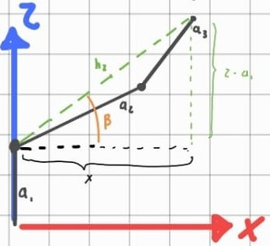
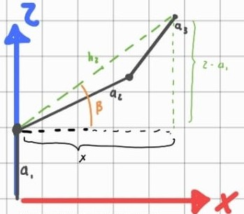
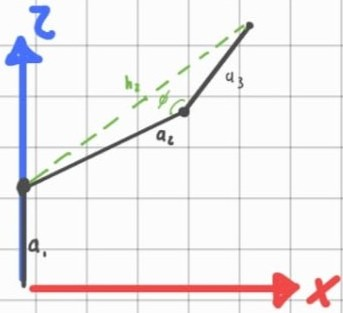

# Inverse Kinematics and Jacobian

## 1. Overview

This section presents the inverse kinematic analysis of the manipulator and the derivation of the Jacobian from the end-effector position equations.

First, the geometric relationships used to obtain the inverse kinematics equations are introduced. Then, the homogeneous transformations are developed to obtain the complete forward kinematic model \(T_0^3\). Finally, the position vector of the end-effector is extracted and differentiated with respect to the joint variables in order to construct the linear Jacobian.

---

## 2. Calculation of the Hypotenuse \(h_2\)

From the geometric analysis of the manipulator, the following relationship for \(h_2\) is obtained:

$$
h_2^2 = x^2 + (z - a_1)^2
$$

Thus, the magnitude of \(h_2\) is:

$$
h_2 = \sqrt{x^2 + (z - a_1)^2}
$$

---

## 3. Calculation of the Angle \(\beta\)

From the manipulator geometry, the angle \(\beta\) is determined using the inverse tangent function:

$$
\beta = \tan^{-1} \left( \frac{z - a_1}{x} \right)
$$

---

## 4. Law of Cosines for \(\phi\)

To determine the internal angle \(\phi\) of the triangle formed by the robot links, the law of cosines is applied:

$$
h_2^2 = a_2^2 + a_3^2 - 2a_2 a_3 \cos(\phi)
$$

Solving for \(\phi\), the following expression is obtained:

$$
\phi = \cos^{-1} \left( \frac{-h_2^2 + a_2^2 + a_3^2}{2 a_2 a_3} \right)
$$

---

## 5. Calculation of the Angle \(\alpha\)

Applying the law of cosines again to the robot arm triangle, the following relationship for side \(a_3\) is obtained:

$$
a_3^2 = a_2^2 + h_2^2 - 2a_2 h_2 \cos(\alpha)
$$

The angle \(\alpha\) is then computed as:

$$
\alpha = \cos^{-1} \left( \frac{-a_3^2 + a_2^2 + h_2^2}{2 a_2 h_2} \right)
$$

---

## 6. Inverse Kinematics Equations

By combining the geometric and trigonometric relationships, the joint angle equations are obtained as functions of the target coordinates \((x, z)\).

### 6.1 Intermediate Variable

First, the hypotenuse \(h_2\) is defined as:

$$
h_2 = \sqrt{x^2 + (z - a_1)^2}
$$

### 6.2 Joint Angle Equations

For the angle \(\theta_2\):

$$
\theta_2 = \tan^{-1} \left( \frac{z - a_1}{x} \right) - \cos^{-1} \left( \frac{-a_3^2 + a_2^2 + h_2^2}{2 a_2 h_2} \right)
$$

For the angle \(\theta_3\):

$$
\theta_3 = 180^\circ - \cos^{-1} \left( \frac{-h_2^2 + a_2^2 + a_3^2}{2 a_2 a_3} \right)
$$

---

## 7. Abbreviated Notation

To simplify the trigonometric expressions used in the matrices and in the Jacobian, the following notation is adopted:

$$
c_1 = \cos(q_1), \qquad c_2 = \cos(q_2), \qquad c_3 = \cos(q_3)
$$

$$
s_1 = \sin(q_1), \qquad s_2 = \sin(q_2), \qquad s_3 = \sin(q_3)
$$

Likewise, for combined angles:

$$
c_{23} = \cos(q_2+q_3), \qquad s_{23} = \sin(q_2+q_3)
$$

---

## 8. Homogeneous Matrix Multiplication \(\left(T_0^1 \cdot T_1^2\right)\)

The product corresponding to the homogeneous transformation matrices of the first two links is:

$$
T_0^1 \cdot T_1^2 = 
\begin{pmatrix}
\cos(q_1) & 0 & -\sin(q_1) & 0 \\
\sin(q_1) & 0 & \cos(q_1) & 0 \\
0 & -1 & 0 & a_1 \\
0 & 0 & 0 & 1
\end{pmatrix}
\cdot
\begin{pmatrix}
\cos(q_2) & -\sin(q_2) & 0 & a_2\cos(q_2) \\
\sin(q_2) & \cos(q_2) & 0 & a_2\sin(q_2) \\
0 & 0 & 1 & 0 \\
0 & 0 & 0 & 1
\end{pmatrix}
$$

---

## 9. Resulting Matrix \(\left(T_0^2\right)\)

The resulting matrix from the product \(T_0^1 \cdot T_1^2\) is:

$$
T_0^2 = 
\begin{pmatrix}
\cos(q_1)\cos(q_2) & -\cos(q_1)\sin(q_2) & -\sin(q_1) & a_2\cos(q_1)\cos(q_2) \\
\sin(q_1)\cos(q_2) & -\sin(q_1)\sin(q_2) & \cos(q_1) & a_2\sin(q_1)\cos(q_2) \\
-\sin(q_2) & -\cos(q_2) & 0 & -a_2\sin(q_2) + a_1 \\
0 & 0 & 0 & 1
\end{pmatrix}
$$

The position terms of this transformation are:

$$
x = a_2 \cos(q_1)\cos(q_2)
$$

$$
y = a_2 \sin(q_1)\cos(q_2)
$$

$$
z = -a_2 \sin(q_2) + a_1
$$

---

## 10. Homogeneous Matrix Multiplication \(\left(T_0^2 \cdot T_2^3\right)\)

The intermediate matrix \(T_0^2\) is multiplied by the transformation matrix \(T_2^3\):

$$
T_0^2 T_2^3 =
\begin{bmatrix}
\cos(q_1)\cos(q_2) & -\cos(q_1)\sin(q_2) & -\sin(q_1) & a_2\cos(q_1)\cos(q_2) \\
\sin(q_1)\cos(q_2) & -\sin(q_1)\sin(q_2) & \cos(q_1) & a_2\sin(q_1)\cos(q_2) \\
-\sin(q_2) & -\cos(q_2) & 0 & -a_2\sin(q_2) + a_1 \\
0 & 0 & 0 & 1
\end{bmatrix}
\;
\begin{bmatrix}
\cos(q_3) & -\sin(q_3) & 0 & a_3\cos(q_3) \\
\sin(q_3) & \cos(q_3) & 0 & a_3\sin(q_3) \\
0 & 0 & 1 & 0 \\
0 & 0 & 0 & 1
\end{bmatrix}
$$

---

## 11. Resulting Homogeneous Transformation Matrix \(T_0^3\)

The resulting matrix, which represents the position and orientation of the end-effector with respect to the base frame, is:

$$
T_0^3 = 
\begin{bmatrix}
\cos(q_1)\cos(q_2)\cos(q_3) - \cos(q_1)\sin(q_2)\sin(q_3) & -\sin(q_2+q_3)\cos(q_1) & -\sin(q_1) & a_3\cos(q_1)\cos(q_2)\cos(q_3) + a_2\cos(q_1)\cos(q_2) - a_3\cos(q_1)\sin(q_2)\sin(q_3) \\
\cos(q_2+q_3)\sin(q_1) & -\sin(q_2+q_3)\sin(q_1) & \cos(q_1) & a_3\cos(q_1)\cos(q_2)\cos(q_3) + a_2\sin(q_1)\cos(q_2) - a_3\sin(q_1) \\
-\sin(q_2)\cos(q_3) - \cos(q_2)\sin(q_3) & -\cos(q_2+q_3) & 0 & -a_3\sin(q_2)\cos(q_3) - a_3\cos(q_2)\sin(q_3) - a_2\sin(q_2) + a_1 \\
0 & 0 & 0 & 1
\end{bmatrix}
$$

The position vector contained in the fourth column is:

$$
P_x = \cos(q_1)(a_3\cos(q_2+q_3) + a_2\cos(q_2))
$$

$$
P_y = \sin(q_1)(a_3\cos(q_2+q_3) + a_2\cos(q_2))
$$

$$
P_z = -a_3\sin(q_2+q_3) - a_2\sin(q_2) + a_1
$$

---

## 12. End-Effector Position Vector

From the last column of matrix \(T_0^3\), the position vector of the end-effector is obtained as:

$$
P =
\begin{bmatrix}
a_3(c_1)(c_2)(c_3)+a_2(c_1)(c_2)-a_3(c_1)(s_2)(s_3) \\
a_3(s_1)(c_2)(c_3)+a_2(s_1)(c_2)-a_3(s_1)(s_2)(s_3) \\
-a_3(s_2)(c_3)-a_3(c_2)(s_3)-a_2(s_2)+a_1
\end{bmatrix}
$$

---

## 13. Partial Derivatives for the Linear Jacobian

Differentiating the position vector with respect to the joint variables \(q_1\), \(q_2\), and \(q_3\), the linear Jacobian \(J_v\) is obtained:

$$
J_v =
\begin{bmatrix}
-a_3(s_1)(c_2)(c_3)-a_2(s_1)(c_2)+a_3(s_1)(s_2)(s_3) &
-a_3(c_1)(s_2)(c_3)-a_2(c_1)(s_2)-a_3(c_1)(c_2)(s_3) &
-a_3(c_1)(c_2)(s_3)-a_3(c_1)(s_2)(c_3)
\\
a_3(c_1)(c_2)(c_3)+a_2(c_1)(c_2)-a_3(c_1)(s_2)(s_3) &
-a_3(s_1)(s_2)(c_3)-a_2(s_1)(s_2)-a_3(s_1)(c_2)(s_3) &
-a_3(s_1)(c_2)(s_3)-a_3(s_1)(s_2)(c_3)
\\
0 &
-a_3(c_2)(c_3)+a_3(s_2)(s_3)-a_2(c_2) &
a_3(s_2)(s_3)-a_3(c_2)(c_3)
\end{bmatrix}
$$

Each column of this matrix represents the contribution of one joint variable to the variation of the end-effector position.